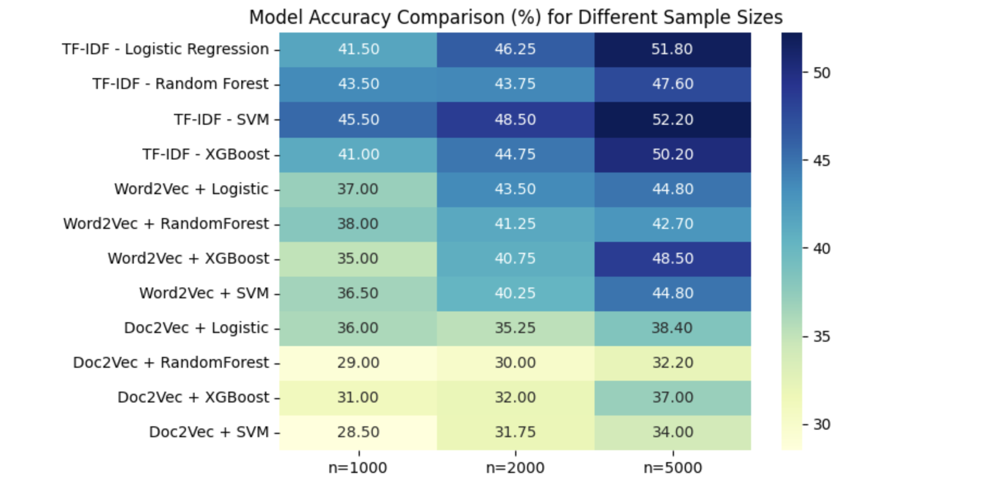

# NLP-and-Embeddings-for-Economic-Sector-Classification-in-Small-Job-Posting-Data
### Author: etorresram
## Project Description
This project applies various classification models to predict economic sectors based on the 2-digit NAICS classification for job postings. The focus is on working with small samples extracted from a larger dataset. By preprocessing the text data (cleaning, stopwords removal, lemmatization) and vectorizing it with techniques such as TF-IDF, Word2Vec, and Doc2Vec, multiple classification models are evaluated. The goal is to compare the performance of different models in predicting the correct economic sector.

## Key Features

- **Text Preprocessing:** Clean job posting descriptions, remove stopwords, and apply lemmatization.
- **Multiple Vectorization Techniques:** 
  - TF-IDF for a traditional text representation.
  - Word2Vec and Doc2Vec for dense vector representations.
- **Model Evaluation:** Evaluate different classifiers such as Logistic Regression, Random Forest, SVM, and XGBoost.
- **Small Sample Analysis:** Compare model accuracies on small samples (e.g., 1000, 2000, and 5000 job postings) to evaluate performance scalability.
- **Visualization:** Generate comparative visualizations (e.g., heatmaps) to display model accuracy across different sample sizes.

## Technologies and Libraries

- **Python 3**
- **Pandas & NumPy:** Data manipulation and analysis.
- **NLTK:** Text preprocessing (stopwords removal and lemmatization).
- **Gensim:** Implementation of Word2Vec and Doc2Vec models.
- **Scikit-Learn:** TF-IDF vectorization, classifiers, train/test split, and evaluation metrics.
- **XGBoost:** Boosting algorithm for classification.
- **Matplotlib & Seaborn:** Data visualization.
- **Imbalanced-Learn:** (Optional) For resampling if needed.

## Installation

1. **Clone the repository:**
   ```bash
   git clone https://github.com/etorresram/NLP-and-Embeddings-for-Economic-Sector-Classification-in-Small-Job-Posting-Data.git


## Findings

- **Sample Size Effect:**  
  The results presented here are based on small sample sizes (1,000 to 5,000 rows). As the sample size increases, all models show improved accuracy. This highlights the importance of having more data for better performance. Note that while TF-IDF currently outperforms the embedding methods in these small samples, Word2Vec and Doc2Vec may deliver better results when applied to larger datasets.

- **Vectorization Methods:**  
  TF-IDF consistently achieves higher accuracy under these small sample conditions. In contrast, the distributed representations from Word2Vec and Doc2Vec might capture more complex semantic relationships, which could prove advantageous with larger amounts of data.

- **Classifier Performance:**  
  Classifiers such as XGBoost and SVM generally outperform Logistic Regression and Random Forest when used with TF-IDF. However, the overall accuracies are modest (mostly under 50%), reflecting the challenges in classifying job postings into 2-digit NAICS codes.

- **Key Takeaway:**  
  Under a small sample environment, combining TF-IDF with advanced classifiers like XGBoost or SVM appears to be the most effective approach. With larger datasets, exploring Word2Vec and Doc2Vec methods may lead to further improvements.

## Accuracy Matrix


   
